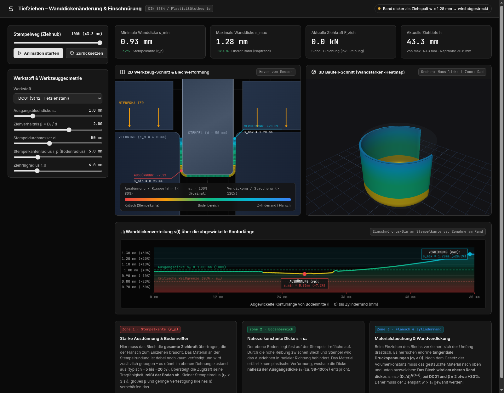

# BBRZ-JET_Stuff

**Tiefzieh-Berechnungssuite & interaktive 2D/3D-Umformsimulation**
*Begleitmaterial für Ausbildung und Vertiefung im Fachgebiet Fertigungstechnik / Umformen (DIN 8584; Aufgaben nach Rechenbuch Metall, S. 248, Europa-Lehrmittel)*



---

## Inhalt

```
BBRZ-JET_Stuff/
├── simulation/            # Interaktive 2D/3D-Simulation (läuft offline im Browser)
│   ├── index.html         # Oberfläche: Steuerpanel, Kennwerte, Ansichten
│   ├── simulation.js      # Physikmodell (Materialpunkte, Hill, Siebel, Bodenreißer)
│   ├── view2d.js          # 2D-Werkzeugschnitt mit Blechverformung
│   ├── view3d.js          # 3D-Schnittmodell mit Dicken-Farbkodierung (Three.js)
│   ├── chart.js           # Wanddickenverlauf s(l) über der Konturlänge (Canvas 2D)
│   ├── app.js             # UI-Zustand, Parameter-Bindings, Animation
│   ├── style.css          # Layout inkl. Handy-Breakpoint
│   ├── serve.py           # Optionaler Webserver mit HTTP-Basic-Auth
│   ├── preview*.png       # Screenshots (Ende bzw. Anfang des Hubs)
│   └── lib/               # Three.js + OrbitControls, lokal eingebunden
├── excel/
│   ├── generate_excel.py  # Erzeugt die Arbeitsmappe (openpyxl)
│   └── Tiefziehen_Berechnungen_Uebungen_6-10.xlsx
└── docs/
    └── rechenbuch_metall_uebungen_6-10.md  # Musterlösungen mit Rechenweg
pyramid-volume.html        # Geometrie: Warum ist eine Pyramide genau ⅓? (eigenständige Seite, EN/DE)
```

---

## 1. Interaktive Tiefzieh-Simulation (`simulation/`)

Die Simulation zeigt den **Erstzug eines zylindrischen Napfes** – vom ebenen Zuschnitt bis zum fertig durchgezogenen Napf – mit Wanddickenverlauf, Ziehkraft und Versagensgrenzen. Einstellbar sind Werkstoff, Blechdicke s₀, Ziehverhältnis β, Stempeldurchmesser d sowie Stempel- und Ziehringradius.

### Das Modell

Ein **halbanalytisches, volumenerhaltendes Membranmodell**. Es ist ein Lehrmodell und keine FEM – aber jeder gezeigte Effekt folgt aus einem physikalischen Zusammenhang statt aus einer gezeichneten Kurve:

* **Materialpunkte, Volumenkonstanz:** Jeder Punkt der Ronde (Anfangsradius $R$) wird über den gesamten Hub verfolgt und so auf der aktuellen Blechmittellinie platziert, dass $\int 2\pi\,x\,s\,dl = \pi R^2 s_0$ gilt. Das Volumen bleibt dadurch exakt erhalten. Die Mittellinie besteht aus Boden, Stempelrundung, freier Zarge (gemeinsame Tangente beider Werkzeugradien), Ziehringrundung und Flansch.
* **Flansch & Ziehring – Stauchung und Verdickung:** Radialspannung aus dem Gleichgewicht nach Siebel, integriert über das tatsächlich verfestigte Flanschmaterial ($\sigma_r = \int Y\,k_f(\varepsilon)\,d\rho/\rho$ plus Niederhalterreibung). Die Tangentialspannung folgt aus der Fließbedingung nach Hill (1948) mit senkrechter Anisotropie $r$, die Dickenänderung aus der zugehörigen Fließregel. Am freien Rand ($\sigma_r = 0$) ergibt das $s/s_0 = (R_0/r)^{1/(1+r)}$ – die Verdickung ist am Napfrand am größten.
* **Biegen und Rückbiegen am Ziehring** kostet je Durchlauf etwa $(\sigma_r/k_f)\cdot s/(4\rho)$ an Dicke.
* **Ziehspalt & Abstrecken:** Material, das dicker als der Ziehspalt $w = 1{,}28 \cdot s_0$ ist, wird beim Einlaufen auf $w$ abgestreckt; die Simulation meldet das.
* **Boden, Stempelkante, Zarge – Ausdünnung und Bodenreißer:** Diese Bereiche übertragen die Zugkraft aus dem Ziehring. Ein Punkt dünnt erst aus, wenn die Linienlast seine Tragfähigkeit $s \cdot k_f(\varepsilon)$ übersteigt (ebener Dehnungszustand, im Boden zweiachsig; Verfestigung nach Hollomon mit $R_e$, $R_m$, $n$). Vorverfestigtes Material ist fester – deshalb schnürt das kaum verformte Material an der Stempelkante ein. Übersteigt die Last die maximale Tragfähigkeit (Instabilität bei $\varepsilon \approx n$), **reißt der Boden ab** und der Napf bleibt bei diesem Hub stehen.
* **Ziehkraft** = senkrechte Komponente der Zargenzugkraft, $F = 2\pi x\,t\,\sin\theta$. Daraus ergibt sich der typische Kraft-Weg-Verlauf mit dem Maximum bei etwa 30–40 % des Hubs und dem Abfall auf 0 kN, wenn der Rand den Ziehring verlässt.

### Plausibilität

| Größe (DC01, β = 2, d = 50 mm, s₀ = 1 mm, r_p = 5 mm, r_d = 6 mm) | Modell | Vergleich |
|---|---|---|
| Volumen am Ende / Ausgangsvolumen | 1,000 | exakt 1 |
| Maximale Ziehkraft | ≈ 54 kN | Siebel-Handrechnung ≈ 59 kN |
| Ausdünnung an der Stempelkante | ≈ −7 % | typisch −5 … −20 % |
| Verdickung am Rand (vor dem Abstrecken) | ≈ +30 % | Näherung $\sqrt{\beta}$: +41 % (für r = 1) |
| Napfhöhe | ≈ 37 mm | $h = (D_0^2 - d^2)/(4d)$ = 37,5 mm |

Grenzziehverhältnisse, bei denen das Modell bei sonst gleichen Parametern den Bodenreißer zeigt: DC01 ≈ 2,25 · DC04 > 2,3 · Cu-ETP ≈ 2,05 · 1.4301 ≈ 2,15 · EN AW-Al 99,5 ≈ 1,9 (Tabellenwert 2,1).

### Modellgrenzen

Nicht abgebildet sind Faltenbildung im Flansch, Zipfelbildung (planare Anisotropie Δr), Rückfederung und die Kraft für das Abstrecken. Reibwerte (μ = 0,08 an Ziehring und Niederhalter, 0,15 am Stempel) und die Biegeüberhöhung an der Stempelkante sind feste Annahmen. Die Werte eignen sich für den Unterricht, nicht als Auslegungsgrundlage.

### Starten

`simulation/index.html` direkt im Browser öffnen – alle Bibliotheken liegen lokal in `simulation/lib/`. Alternativ über einen lokalen Webserver:

```bash
cd simulation
python3 -m http.server 8080
# http://localhost:8080
```

**Mit Passwortschutz** (z. B. für den Zugriff vom Handy über ein VPN oder einen Reverse-Proxy): `serve.py` liefert den Ordner auf `127.0.0.1` mit HTTP-Basic-Auth aus und startet ohne Zugangsdaten gar nicht.

```bash
BBRZ_USER=… BBRZ_PASS=… BBRZ_PORT=8079 python3 simulation/serve.py
```

---

## 2. Excel-Arbeitsmappe (`excel/`)

[`Tiefziehen_Berechnungen_Uebungen_6-10.xlsx`](excel/Tiefziehen_Berechnungen_Uebungen_6-10.xlsx) enthält editierbare Formelblätter (Eingaben gelb, Ergebnisse grün) für die Tiefziehaufgaben 6–10:

| Blatt | Thema | Ergebnis |
|---|---|---|
| **Formelsammlung** | Grundlagen | Oberflächengleichheit $D = \sqrt{4 A / \pi}$, Ziehverhältnisse $\beta_1, \beta_n, \beta_{\text{ges}}$, Richtwerte für Stahl, Al, Cu, Ms |
| **Aufgabe 6** | Kleinster Ziehteildurchmesser | $D = 117\text{ mm}$, DC01 $\implies d_{1,\min} = D / \beta_{1,\max} = \mathbf{55{,}71\text{ mm}}$ |
| **Aufgabe 7** | Zylinder ohne Rand | $d = 20$, $h = 30\text{ mm}$, DC04 $\implies D = \mathbf{52{,}92\text{ mm}}$, $\beta_{\text{ges}} = 2{,}65 \implies \mathbf{2\text{ Züge}}$ ($d_1 = 25{,}2\text{ mm}$) |
| **Aufgabe 8** | Relaisgehäuse (Mehrstufenzug) | $d = 15$, $h = 60\text{ mm}$, EN AW-Al 99,5 $\implies D = \mathbf{61{,}85\text{ mm}}$, $\mathbf{3\text{ Züge}}$ ($d_1=29{,}45$, $d_2=18{,}41$, $d_3=15\text{ mm}$) |
| **Aufgabe 9** | Kegeleinsatz mit Rand | Boden $d_1=40$, Kegelstumpf bis $d_2=60$, Zylinder $h_z=20$, Flansch $d_3=80\text{ mm}$ $\implies A_{\text{ges}} = 15\,235\text{ mm}^2$, $D = \mathbf{139{,}28\text{ mm}}$ |
| **Aufgabe 10** | Kupferbehälter in einem Zug | $d = 74\text{ mm}$, $\beta_1 = 2{,}1 \implies D = \mathbf{155{,}4\text{ mm}}$, $h_{\max} = \mathbf{63{,}1\text{ mm}}$; Streifen $B = 160\text{ mm}$ $\implies$ Ausnutzung $\eta = \mathbf{74{,}8\,\%}$ |

Neu erzeugen (benötigt `openpyxl`):

```bash
pip install openpyxl
python3 excel/generate_excel.py   # schreibt die .xlsx neben das Skript
```

Die Datei enthält Formeln ohne vorberechnete Werte. Excel und LibreOffice rechnen beim Öffnen; reine Dateivorschauen zeigen die Ergebniszellen leer.

---

## 3. Musterlösungen (`docs/`)

[`docs/rechenbuch_metall_uebungen_6-10.md`](docs/rechenbuch_metall_uebungen_6-10.md) enthält die Formeln und die Lösungen der Aufgaben 6–10 mit vollständigem Rechenweg.

---

## 4. Pyramidenvolumen – „Warum genau ein Drittel?“ (`pyramid-volume.html`)

Eigenständige, interaktive Seite zur Formel $V = \tfrac{1}{3}\,a^2\,h$ der quadratischen Pyramide. Eine HTML-Datei, läuft offline, nichts zu installieren; Sprache EN/DE (automatisch nach Browsersprache, umschaltbar). Alle 3D-Figuren lassen sich mit der Maus oder den Pfeiltasten drehen.

**Online:** <https://gleinkaa.github.io/BBRZ-JET_Stuff/pyramid-volume.html>

1. **Experiment** – drei Pyramiden voll Wasser füllen den Quader gleicher Grundfläche und Höhe (animiert, mit ⅓- und ⅔-Marken).
2. **Beweis, Schritt 1** – ein Würfel zerfällt in drei deckungsgleiche Pyramiden, also ist jede ⅓ · a³. Regler zum Auseinanderziehen, „Vergleichen“ stellt die Teile gleich gedreht nebeneinander.
3. **Beweis, Schritt 2** – Strecken (Höhe) und Verschieben der Spitze (Cavalieri): gleiche Schnittflächen, gleiches Volumen – damit gilt ⅓ für jede quadratische Pyramide.
4. **Nachrechnen** – Treppenpyramide aus n Platten (außen/innen), exakte Summe (1² + … + n²)/n³ und Diagramm, das von beiden Seiten gegen ⅓ läuft.
5. **Zusammenfassung** mit Integralrechnung und dem Hinweis, dass ⅓ · G · h für jede Grundfläche gilt (auch Kegel).

---

## Technik

* **Frontend:** HTML, CSS und JavaScript ohne Build-Schritt (klassische `<script>`-Dateien)
* **3D:** [Three.js](https://threejs.org/) mit OrbitControls, Rendering nur bei Änderungen
* **2D & Diagramm:** Canvas 2D API mit HiDPI-Skalierung
* **Tabellenkalkulation:** Python mit [openpyxl](https://openpyxl.readthedocs.io/)

---

## Lizenz

[MIT](LICENSE). Die mitgelieferten Bibliotheken in `simulation/lib/` (Three.js und dessen OrbitControls) stehen unter der MIT-Lizenz der Three.js Authors. Die Aufgaben 6–10 stammen aus dem *Rechenbuch Metall* (Europa-Lehrmittel); hier sind nur eigene Zusammenfassungen und Lösungswege enthalten, nicht der Buchtext.

---

*Erstellt für Bildungs- und Ausbildungszwecke im Rahmen des BBRZ-/JET-Programms.*
